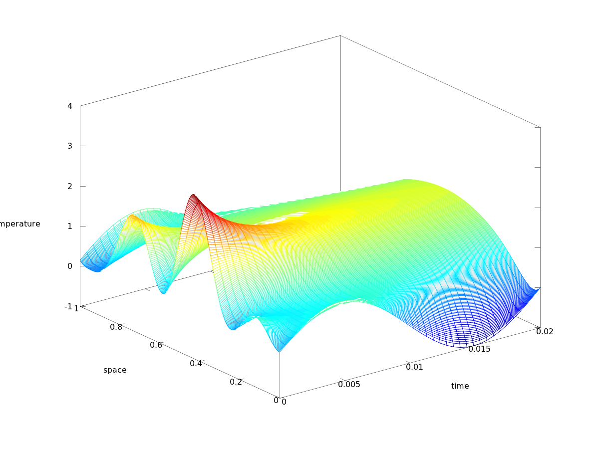

To test my understanding of the FDM method I made a simple
implementation of the Crank-Nickelson method applied on the heat
equation. The physical intepretation is this: You have a perfectly
insulated rod of length \\(l\\). At time \\(t_0\\) you know the
temperature distribution in the rod, \\(f(x)\\). You also know that each
end of the rod will have a temperature that is a function of time,
\\(g_0(t)\\) and \\(g_1(t)\\). Given this information, what will the
temperature in the rod be at an arbitraray time \\(t\\) and position
\\(x\\)? This is what the heat equation tells you, the problem, as usual
with partial differential equations is that you can't always solve them
explicitly. This is where numerical techniques comes to play and saves
the day. Below is the result of a numerical simulation of such a
senario. For simplicity the rods length is \\(1\\). 

\\[ f(x) = (2+2\sin(6 \pi x)) (1-|2(x-1)|), 0 \leq x \leq1 \\] 
\\[ g_0(x) = g_1(x) = \sin(t), 0 \leq t \\]

This gives rise to the following solution:



Here is the Octave code that calculates this plot, quite simple and self
explanetory:

``` {.sourceCode .octave}
M = 401; % number of space nodes
h = 1/(M+1); % space step size

T = 40000;  % number of timesteps
t = 0.0000005; % time step size

%U0 = 1-abs(linspace(-1,1,M)); % initial data
U0 = (2+2*sin(linspace(0,6*pi,M))).*(1-abs(linspace(-1,1,M))); % initial data
G1 = sin(linspace(0,2*pi,T));
GM = G1;

r = t/h^2;

U = zeros(M,T);
U(:,1) = U0;

n = M;
e = ones(n,1);
A = spdiags([e, -2*e, e], -1:1, n, n);

lkern = eye(M) + (r/2)*A;
rkern = eye(M) - (r/2)*A;

%for y=1:100
  U(:,1) = U0;
  for i=1:T-1
    U(:,i+1) = rkern\(lkern*U(:,i));
    U(1,i+1) = G1(i+1);
    U(M,i+1) = GM(i+1);
  end
%end

downscale = 1000;

Y = zeros(M,T/downscale);
for i=1:T/downscale;
  Y(:,i) = U(:,downscale*i);
end

tx = linspace(0,1,M);
tt = linspace(0,t*T,T/downscale);
hold off
mesh(tt,tx,Y);
%contour(U)
ylabel('space');
xlabel('time');
```
